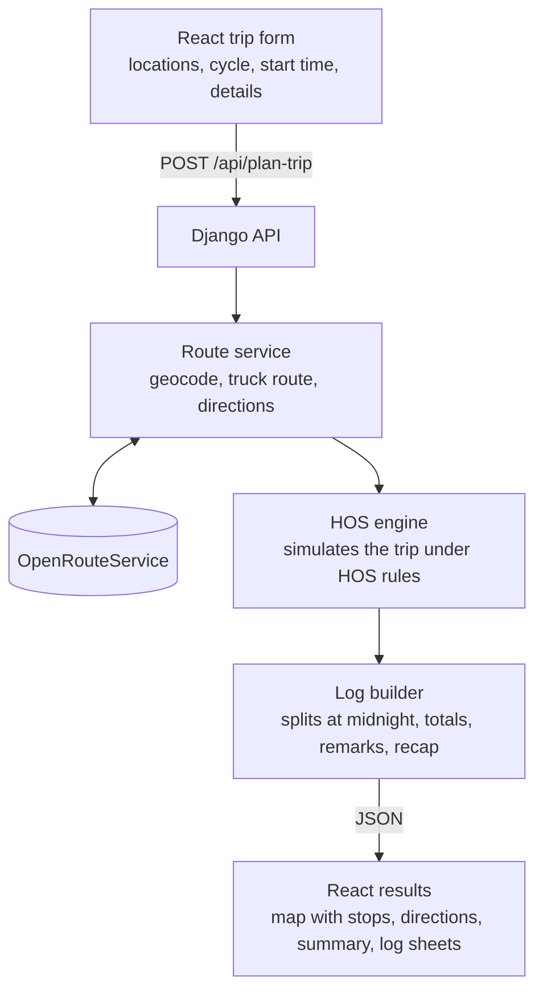
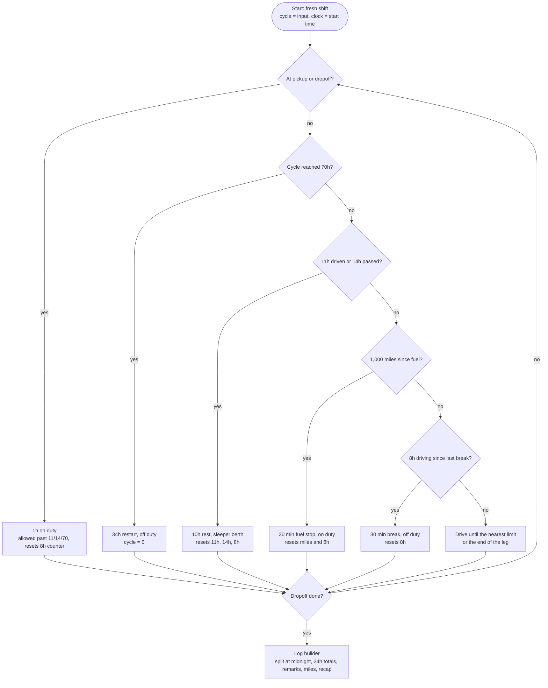

# ELD Trip Planner

A full-stack app that plans a truck trip under FMCSA Hours of Service rules. Enter where the truck is, where it picks up, where it drops off, and how many cycle hours the driver has used. The app returns the route on a map with every required stop, turn-by-turn directions, and the filled-in Driver's Daily Log sheets for each day of the trip.

Built with Django and React for the Spotter AI full-stack assessment.

- **Live app:** [link]
- **Loom walkthrough:** [link]


## What it does

**Inputs**
- Current location
- Pickup location
- Dropoff location
- Current cycle used (hours, 0 to 70)
- Start date and time (defaults to now)
- Optional driver and carrier details printed on the log sheets (driver name and number, co-driver, carrier, office and home terminal addresses, truck and trailer numbers, shipping document)

**Outputs**
- Route map with markers for pickup, dropoff, fuel stops, 30-minute breaks, 10-hour rests and 34-hour restarts
- Turn-by-turn route instructions
- Trip summary: total miles, number of days, stop list, cycle hours used after the trip, hours available the next day
- One Driver's Daily Log sheet per calendar day, drawn on the standard grid, with hours totals, remarks, miles and the 70-hour recap

## Architecture



- **Route service** geocodes the three locations, requests the route from OpenRouteService using the heavy goods vehicle profile (truck speeds, not car speeds), and returns distance, duration, geometry and directions for both legs.
- **HOS engine** simulates the trip step by step and produces a timeline of duty status events, each with a start, end, status and location.
- **Log builder** cuts the timeline at midnight into daily log sheets, computes the hours per row (always 24 in total), the remarks, the miles driven and the recap.

## Hours of Service rules implemented

Property-carrying driver on the 70-hour / 8-day schedule.

| Rule | What counts | Reset by |
|---|---|---|
| 11-hour driving limit per shift | Driving | 10 consecutive hours off duty or sleeper berth |
| 14-hour window per shift | Clock time from shift start, never paused | 10 consecutive hours off duty or sleeper berth |
| 30-minute break after 8 hours of driving | Cumulative driving | Any 30 consecutive minutes not driving |
| 70 hours in 8 days | Driving + on duty | 34 consecutive hours off duty or sleeper berth |
| Fuel at least every 1,000 miles | Miles driven | Fuel stop |

Notes:
- After hour 14 (or after 11 hours of driving), driving stops but on-duty work such as a dropoff is still allowed.
- Pickup, dropoff and fuel stops are 30+ minutes not driving, so they also satisfy the 30-minute break.

### Engine logic

At every stop point the engine checks the rules in this order, so one stop can cover several needs.



## Assumptions and design decisions

From the assessment:
- Property-carrying driver, 70 hours / 8 days, no adverse driving conditions
- Fueling at least once every 1,000 miles
- 1 hour on duty for pickup and 1 hour for dropoff

Decisions made where the assessment is silent:
- **Fresh shift at the start.** The inputs say nothing about the current shift, so the driver is assumed to start after a full 10-hour rest.
- **No rolling 8-day window.** The input gives one cycle total, not daily history, so hours are only added, never dropped. This is conservative: plans are always legal, at most slightly stricter than needed. In practice a 34-hour restart happens before an 8-day window would matter.
- **34-hour restart when the cycle reaches 70.** The restart is optional by law, but without daily history it is the only reliable way to free hours.
- **Fuel stop = 30 minutes on duty**, following the example in the FMCSA driver's guide.
- **Status choices:** 30-minute breaks are logged off duty, 10-hour rests in the sleeper berth, 34-hour restarts off duty, and pickup, dropoff and fueling on duty.
- **No sleeper berth split (7/3 or 8/2).** Every rest is one 10-hour block.
- **No pre-trip or post-trip inspection time**, since the assessment's assumptions do not include it.
- **One time zone for the whole trip.** FMCSA requires logs in home terminal time even across zones; the current location's time zone is used as home terminal time and shown on every sheet.
- **Trip is current → pickup → dropoff.** Extra stops are planned as a new trip.
- **Truck routing.** Drive times come from OpenRouteService's heavy goods vehicle profile.

## Privacy

There is no database and no login. Nothing is stored: driver details are used only to draw the log sheets and are gone when the page closes. Only the three locations are sent to the map API.

## Tech stack

- **Backend:** Python, Django, Django REST Framework
- **Frontend:** React (Vite), Leaflet with OpenStreetMap tiles, log sheets drawn as SVG
- **Map API:** OpenRouteService (geocoding, truck routing, directions, reverse geocoding)
- **Hosting:** Vercel

## Running locally

Requirements: Python 3.11+, Node 18+, a free OpenRouteService API key from openrouteservice.org.

Backend:
```bash
cd backend
python -m venv venv
source venv/bin/activate        # Windows: venv\Scripts\activate
pip install -r requirements.txt
cp .env.example .env            # add your ORS_API_KEY
python manage.py runserver
```

Frontend:
```bash
cd frontend
npm install
cp .env.example .env            # set the backend URL
npm run dev
```

## API

`POST /api/plan-trip`

```json
{
  "current_location": "Chicago, IL",
  "pickup_location": "St. Louis, MO",
  "dropoff_location": "Dallas, TX",
  "current_cycle_used": 20,
  "start_time": "2026-10-05T06:00:00"
}
```

Returns the route, stops, directions, trip summary and the daily log sheets.

## Tests

The HOS engine is covered by unit tests, including:
- A two-day trip with a 30-minute break and a 10-hour rest crossing midnight
- A high cycle input (60 hours) that forces a 34-hour restart and produces a full off-duty day
- A trip over 1,000 miles with a fuel stop that also satisfies the 30-minute break
- Arrival at dropoff at the end of the 14-hour window (dropoff still allowed)
- A cycle input of 70, which starts the trip with a restart
- Every log sheet totaling exactly 24 hours

```bash
cd backend
python manage.py test
```

## Possible improvements

- Sleeper berth split support (7/3 and 8/2)
- Daily cycle history input to apply the real rolling 8-day window
- Optional pre-trip and post-trip inspection time
- Real truck stop locations for rests and fuel
- Export log sheets as PDF
