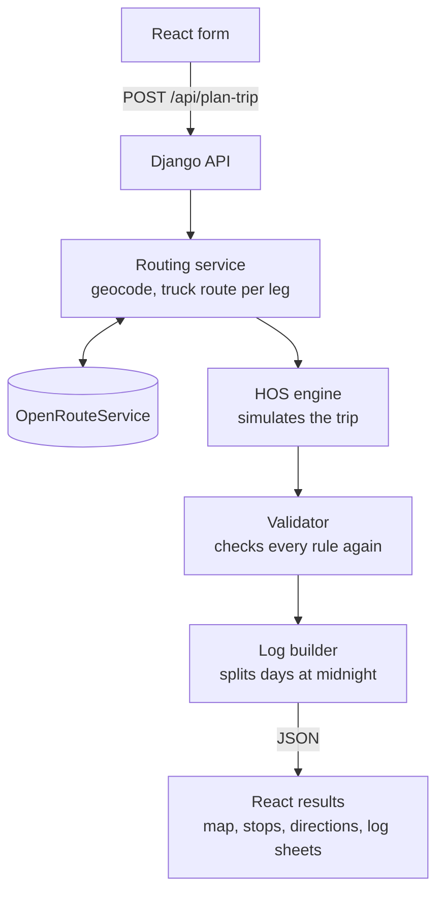
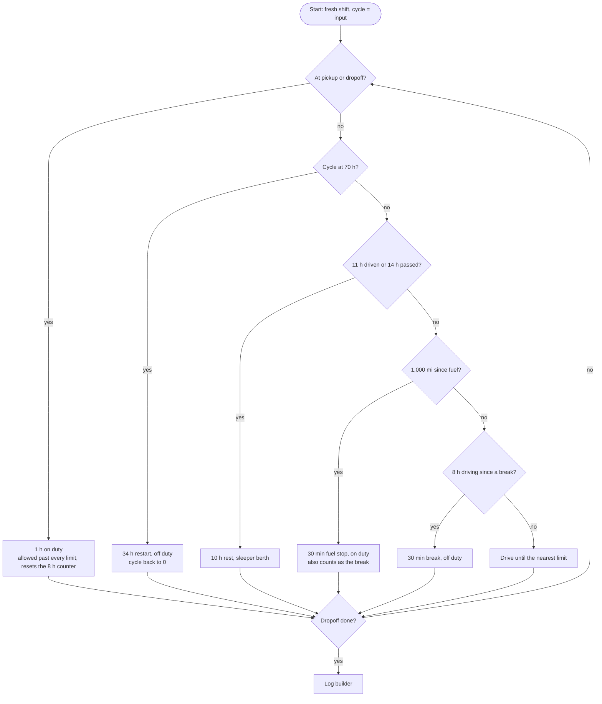

# ELD Trip Planner

Plans a truck trip under the Hours of Service rules of the FMCSA (Federal Motor Carrier Safety Administration). You give it where the truck is, where it picks up, where it drops off, and how many hours the driver has already used in his 70-hour cycle. It returns the truck route on a map with every required stop, turn-by-turn directions, and a filled-in Driver's Daily Log for each day of the trip.

Built with Django and React for the Spotter AI full-stack assessment.

- Live app: https://eld-trip-planner-e3wv.vercel.app
- Loom walkthrough: https://www.loom.com/share/a18a75fff76a49e7be4d2b2e25abbf9d

## What it does

The form takes the three locations, the current cycle used (0 to 70 hours) and a start date and time, which defaults to now. Locations can be a street address, a business, a city and state, or a US ZIP code, with suggestions as you type. The starting point can also come from the browser's location. Driver and carrier details are optional and only go on the log sheets.

The results page shows:

- the route on a map, with a marker for every pickup, dropoff, fuel stop, 30-minute break, 10-hour rest and 34-hour restart
- a stop timeline linked to the map
- turn-by-turn directions for each leg
- a summary: total miles, days, cycle hours used after the trip, and hours available the next day
- one log sheet per calendar day, drawn on the standard grid with totals, remarks, miles and the 70-hour recap, with a viewer and a print layout (one page per day)

When something can't be planned, the app says exactly what and where: the message appears under the field it's about, names the place, and says how to fix it ("No road near Los Angeles County, CA. Please be more specific: enter a city or address in the county."). It never guesses a location the user didn't mean.

## Design

I designed the screens before building them, around a "highway at night" theme: a navy background, amber dashed lane lines as dividers, section headers styled like highway signs, trip stats on mile-marker posts, and route-shield markers on the map. Red is reserved for "stop" signals only (the 34-hour restart, errors, "restart needed"), like tail lights, so it stands out when it appears. Each duty status has its own color, used the same way on the map, the timeline and the log grid, and the off-duty line is darker on the paper sheet so a full rest day never blends into the grid. The log sheet follows the layout and wording of the FMCSA paper form, so anyone who has filled one in recognizes it. The layout works down to phone width, where the log grid scrolls sideways.

## How it works



The routing service turns each location into coordinates and asks OpenRouteService for a truck route, one leg at a time. The HOS engine walks through the trip and produces a timeline of duty status events. Before anything is returned, a separate validator checks that timeline against every rule from scratch; if it finds a violation, the API returns an error instead of an illegal plan. The log builder then cuts the timeline at midnight into daily sheets.

## Hours of Service rules

Property-carrying driver, 70 hours in 8 days, as the assessment specifies.

| Rule | What counts | Reset by |
|---|---|---|
| 11 hours of driving per shift | driving | 10 hours in a row off duty or in the sleeper berth |
| 14-hour window per shift | clock time since the shift started | same 10-hour rest |
| 30-minute break after 8 hours of driving | driving since the last break | any 30 minutes in a row not driving |
| 70 hours in 8 days | driving and on duty | 34 hours in a row off duty or in the sleeper berth |
| fuel at least every 1,000 miles | miles driven | a fuel stop |

Pickup and dropoff take 1 hour on duty each, and a fuel stop takes 30 minutes on duty, following the example in the FMCSA driver's guide. Once a limit is reached the driver can't drive, but on-duty work is still allowed (guide pages 6 and 10), so a pickup or dropoff can happen right as a limit runs out.

### The engine

At each step the engine works out how much is left of every limit (break, 11 hours, 14 hours, 70 hours, miles to fuel, time to the end of the leg) and drives until the smallest one runs out. Whichever limit ran out decides the next stop. Then it checks again.

When two limits run out at the same minute, the order of the checks decides which stop happens, so one stop can cover several needs:



I used a greedy simulation because, with these assumptions, every stop is forced by a rule the moment it's due. There are no real choices to search, so a search (DFS, Dijkstra, dynamic programming) would only find the same schedule more slowly. Greedy is one pass, linear in the number of stops. Search would start to matter with sleeper berth splits, delivery time windows, or a day-by-day cycle history where waiting for old hours to drop off competes with a 34-hour restart.

All time math is in whole minutes, so a limit is either reached or not and the loop can't stall. A safety check raises an error if a step makes no progress.

Two things that surprised me while testing:

- The 14-hour window never ends a shift under these assumptions. The most non-driving time a shift can hold is a pickup, one break and one fuel stop (2 hours), and 11 hours of driving plus 2 hours is 13. The check is still there, since loading delays or waiting time would make it matter.
- A single log sheet can show more than 11 hours of driving and still be legal. The 11-hour limit is per shift, not per calendar day. A trip starting at 18:04 showed 13:30 of driving on day 2: the last 6:04 of one shift, a 10-hour rest, then the first 7:26 of the next.

## Testing

I tested almost every case by hand on the live site, on desktop and on my phone: the form and its errors, autocomplete, the map and timeline, the log viewer, printing, and long multi-day trips. Several trips I checked minute by minute against the rules, including Chicago → Rockford → Denver starting at 70 hours used, New York → Chicago → Los Angeles with and without a restart, and a start at 23:30. That testing found real bugs, which are now in the edge-case table below: a state being swapped silently, coastal cities with no nearby road, cross-country trips over the routing limit, and numeric place names on the logs.

The backend also has automated tests for the engine, the validator, the log builder, routing, stop naming, autocomplete, location checks and the API.

- The engine cases were worked out by hand before writing code. They include the tie cases, where two limits run out together and the test also checks that the stop that shouldn't happen is absent: fuel and break at the same minute (one fuel stop), dropoff exactly at 11 hours (no rest first), dropoff exactly at 70 hours (no restart first), and pickup exactly at 11 hours (pickup, then the rest).
- The validator shares no code with the engine. Mutation tests break a legal plan on purpose (remove the break, the rest, the fuel stop or the restart, shorten the break by one minute) and check that it names the right rule.
- All routing calls are mocked, so the tests don't use the API quota.

```bash
cd backend
.venv\Scripts\python manage.py test trips      # Windows
.venv/bin/python manage.py test trips          # macOS / Linux
```

## Edge cases

| Case | What the app does |
|---|---|
| Cycle input of 70 | starts the trip with a 34-hour restart |
| Cycle reaches 70 mid-route | restart right there; a day fully inside the restart gets its own off-duty sheet |
| Trip ends above 70 (a dropoff past the limit) | shows the true total, like 70:24 / 70, and 0 hours available with "34-hour restart needed" |
| Restart in the middle of a trip | resets the cycle and the shift, but not the miles since the last fuel stop |
| Rest crossing midnight | split across two sheets; a day with no status change still gets a remark |
| Current location = pickup | no driving before the pickup |
| Pickup = dropoff, or all three the same | planned, with a notice (compared by coordinates, not text) |
| Typo, single letter, a state or a country | rejected with a message under that field |
| "Toronto, ON" | rejected as outside the US (the geocoder was silently returning Toronto, Ohio) |
| City center far from a road (Corpus Christi's is in the bay) | snaps to a road within 5 km; further than that fails |
| A county whose center is in the mountains | asks for a city or address in the county |
| Cross-country trips over the routing service's distance limit | each leg is routed separately |
| No road at all (Honolulu) | names the leg that has no route |

## Decisions and assumptions

- Fresh shift at the start: the driver is assumed to start after at least 10 hours off, and to have been off duty from midnight until the trip starts on day 1. The inputs don't say otherwise; an extra input like "hours already worked this shift" would fix that.
- No rolling 8-day window. The input is one cycle total typed by the driver, not a record of the hours for each of the last 8 days, so the app can't know which hours would drop off as days pass, and it has to trust the number. Hours are only added, which makes plans slightly stricter, never illegal. With stored daily logs (the app's own records, or data from the truck's ELD), the cycle could be calculated automatically, including the rolling window, instead of relying on what the driver enters.
- Rest status: 10-hour rests go in the sleeper berth, 34-hour restarts and 30-minute breaks off duty. Both statuses are legal for rests; the label only says where the rest happens.
- No sleeper berth split (7/3 or 8/2) and no inspection time, since the assessment doesn't include them.
- Time zone: times are home terminal time, exactly as the driver enters them. FMCSA requires logs in home terminal time even when the truck crosses zones, so the app does no conversion. A trip that crosses a daylight-saving change can be off by an hour.
- US only, since the app applies FMCSA rules.
- The results show how precise each location was: "(city center)", "(county center)", "(ZIP area)", or nothing for an exact address.
- Stops on rural highways are named by county ("Cass County, IA"), because reverse geocoding only returns a city when the point is inside one.

## Routing data

Routes, distances and drive times come from OpenRouteService's heavy goods vehicle profile. It's free, it has a truck profile, and geocoding, routing and reverse geocoding all use one key. Its truck speeds are conservative: Chicago to Denver comes out around 23 hours, while a loaded truck typically does it in 18 to 19. So plans can take longer than a real trip, but they're always legal, because the engine is exact for whatever drive times it gets. For production I'd look at PC*MILER, the trucking industry standard for mileage and driver pay, or HERE's truck routing, which uses traffic data.

## Privacy

There's no database and no login, and nothing is stored. Driver details are only used to draw the sheets. The three locations go to the map API, and the browser's position is only read and sent when the driver clicks the location button.

## Running locally

You need Python 3.12+, Node 18+, and a free OpenRouteService key from openrouteservice.org.

```bash
# backend
cd backend
python -m venv .venv
.venv\Scripts\activate                # Windows (macOS / Linux: source .venv/bin/activate)
pip install -r requirements.txt
cp .env.example .env                  # add ORS_API_KEY and a SECRET_KEY
python manage.py runserver

# frontend, in a second terminal
cd frontend
npm install
cp .env.example .env                  # VITE_API_URL=http://localhost:8000
npm run dev
```

## API

`POST /api/plan-trip`

```json
{
  "current_location": "Chicago, IL",
  "pickup_location": "Rockford, IL",
  "dropoff_location": "Denver, CO",
  "current_cycle_used": 20,
  "start_time": "2026-10-05T06:00"
}
```

Optional fields: `current_coords` (`{"lat": ..., "lon": ...}` from the location button) and driver and carrier details for the sheets. The response has the trip summary, the route geometry, the stops, the directions per leg and the daily sheets. All times are in whole minutes.

Errors come back as JSON with a code, a message, and the fields they refer to, so the form can show them under the right input.

Other endpoints: `GET /api/autocomplete?text=...`, `GET /api/reverse?lat=...&lon=...` and `GET /api/health`.

## What I'd add next

- Sleeper berth split support
- Stored daily logs (or ELD data), so the cycle and the rolling 8-day window are calculated from real records instead of a typed total
- Picking a location on the map (left out because drivers usually get pickup and dropoff as addresses or ZIP codes)
- Real truck stop locations for rests and fuel
- PC*MILER or HERE for truck drive times
